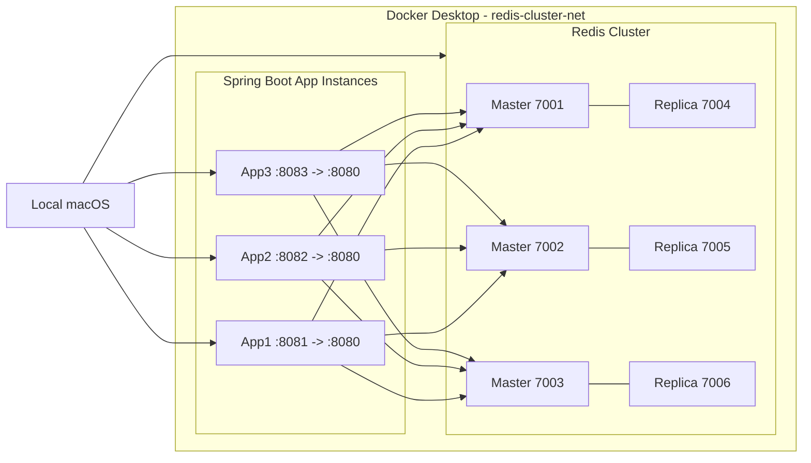

# Architecture Diagram

Phase 1 기준 아키텍처이다.

```mermaid
flowchart LR
    subgraph Docker["Docker Desktop - redis-cluster-net"]
        subgraph Apps["Spring Boot App Instances"]
            App1["App1 :8081 -> :8080"]
            App2["App2 :8082 -> :8080"]
            App3["App3 :8083 -> :8080"]
        end

        subgraph Redis["Redis Cluster"]
            M1["Master 7001"]
            M2["Master 7002"]
            M3["Master 7003"]
            R1["Replica 7004"]
            R2["Replica 7005"]
            R3["Replica 7006"]
        end

        App1 --> M1
        App1 --> M2
        App1 --> M3
        App2 --> M1
        App2 --> M2
        App2 --> M3
        App3 --> M1
        App3 --> M2
        App3 --> M3

        M1 --- R1
        M2 --- R2
        M3 --- R3
    end

    User["Local macOS"] --> App1
    User --> App2
    User --> App3
    User --> Redis
```

Redis 노드는 `redis-cli --cluster create`로 직접 구성한다. 자동 클러스터 구성 이미지는 사용하지 않는다.
