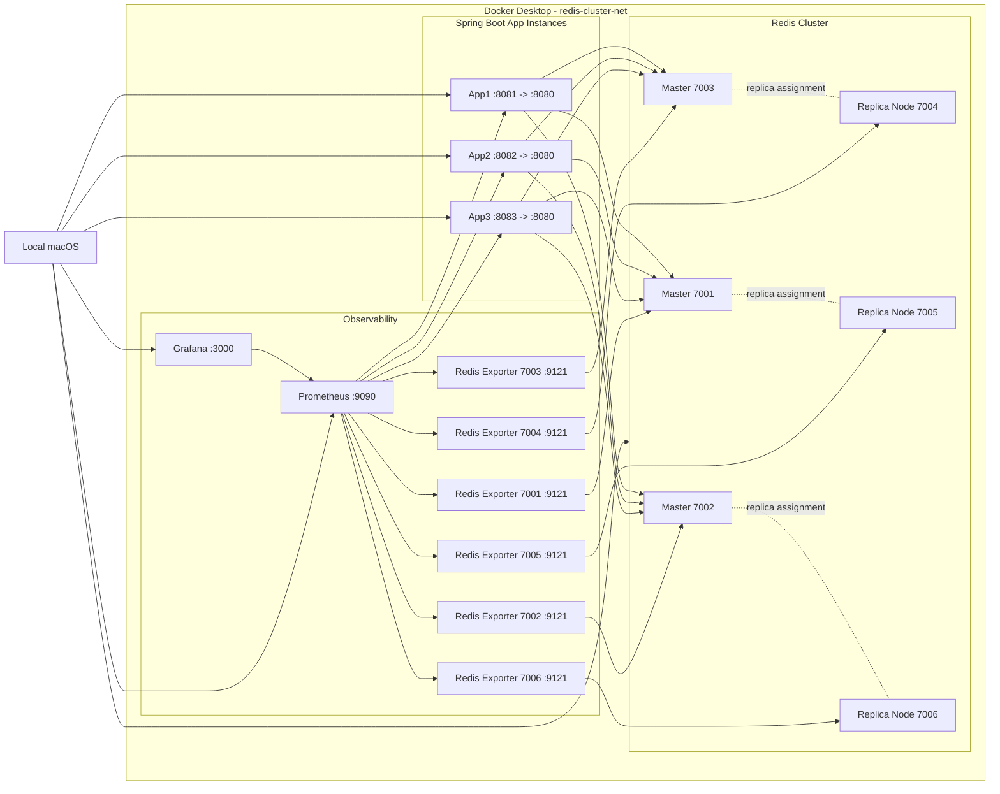

# Architecture Diagram

Phase 2 기준 아키텍처이다.

Redis 노드는 `redis-cli --cluster create`로 직접 구성한다. 자동 클러스터 구성 이미지는 사용하지 않는다.

Prometheus는 Redis Exporter 6개와 Spring Boot Actuator endpoint를 scrape한다. Grafana는 provisioning 설정으로 Prometheus datasource와 `Redis Cluster Lab Observability` dashboard를 자동 등록한다.

Replica assignment는 Phase 1 최초 실행 결과 기준이다. 클러스터를 초기화한 뒤 다시 생성하면 `cluster nodes` 결과를 기준으로 확인한다.
